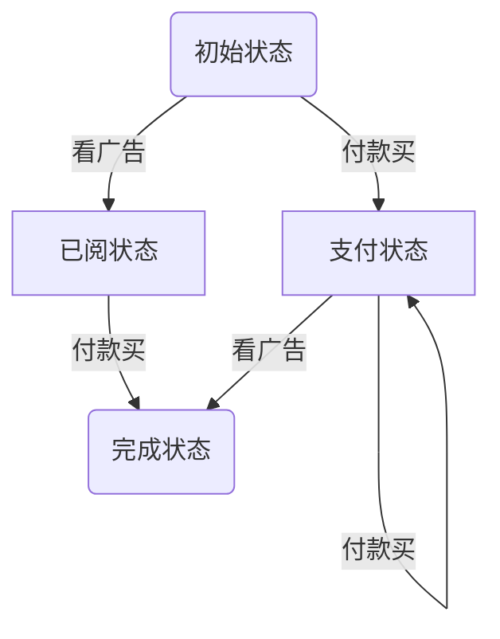
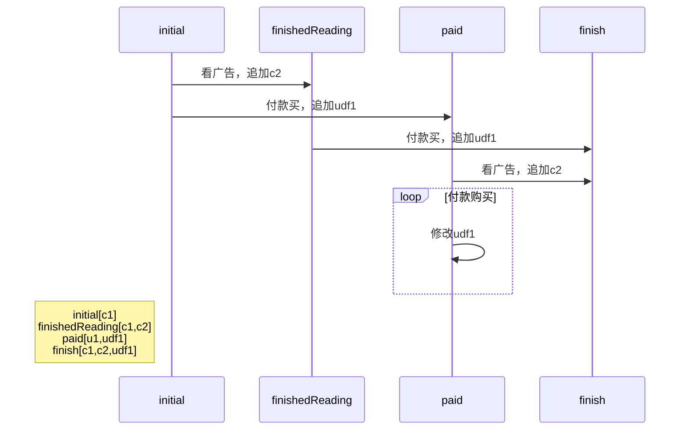

##### 色块

由系统提供，由用户定义；色块由两类构成，一类是c1，c2，...，其中包含确定数量的单品，或者是满足某个条件的单品；另一类是udf1，udf2，...，其中包含的单品数量不确定，或是没有固定的条件限制；两类色块默认的权限均为active，可在策略中定义色块的权限；

对于udf1色块而言，其包含的属性除了普通的色块的属性，关键在于同事件的关联性，与事件如何相关，在策略编写中隐式映射；

在编写策略时，如果要定义色块的权限，可如下定义：

```
c1[active,testActive] // c1色块中的单品拥有active，testActive权限
...
udf1[testActive]	// udf1色块中的单品拥有testActive权限
```


------


##### 例如

[漫画](https://www.yuque.com/docs/share/ea7a221c-0516-493f-a472-bdb9cdb5c3c7?#)，现在有如下要求：

1. 前10话免费
2. 11~20话，看广告免费
3. 后续更新，5毛看一话
4. 一次性购买10话4.5元（9.5折）
5. 一次性购买整本30话12.75块（8.5折）
6. 会员购买再打8.5折。

现在，我们做如下设定：

- c1色块表示1-10话 // 前10话免费

- c2色块表示11-20话 // 看广告 免费

- udf1色块表示付费购买的内容

- watchTheAds() 事件由系统提供，表示看广告

- payEvent(amount，udfN) 事件由系统提供，表示支付amount金额，将某个单品添加到色块udfN中

- payMultiEvent(num，amount，udfN) 事件由系统提供，表示支付amount金额，将num个单品添加到色块udfN中

  两个支付事件的参数列表中，并未包含单品id相关的参数，那如何知道是将哪些个单品放入色块中呢？这个需要与服务端来配合；用户在付款的时候，会勾选付款的单品，服务端根据付款的金额和单品数判断是否合理，成功付款后，服务端将用户勾选的单品放入支付事件参数的色块中；

```
// 色块定义区
service_state_scope
	udf1[active] // 定义udf1色块的权限为active，可不写，默认权限即如此
service_state_scope_end


// 状态机扭转
initial[c1]: // 初始即获得c1色块权限的内容
	watchTheAds() => finishedReading // 看完广告将状态拨到已阅
	payEvent(0.5,udf1) => paid // 支付0.5元购买单话，购买的内容被追加到udf1，将状态拨到支付
    payMultiEvent(10,4.5,udf1) => paid // 支付4.5元购买10话，将购买的内容追加到udf1中，将状态拨到支付
    payMultiEvent(30,12.75,udf1) => paid // 支付12.75元购买30话，将购买的内容追加到udf1中，将状态拨到支付
    
finishedReading[c1,c2]: // 看完广告之后，该状态只包含两个色块，c1，c2
	payEvent(0.5,udf1) => completed
    payMultiEvent(10,4.5,udf1) => completed
    payMulitEvent(30,12.75,udf1) => completed
    
paid[c1,udf1]: // 从初始态跳转到支付状态
	watchTheAds() => completed // 若再看广告，则可进入完成的状态
	payEvent(0.5,udf1) => paid
    payMultiEvent(10,4.5,udf1) => paid
    payMulitEvent(30,12.75,udf1) => paid
    
finish[c1,c2,udf1]: // 完成状态下，已然包含了所需的全部色块，故可自循环
	payEvent(0.5,udf1) => completed
    payMultiEvent(10,4.5,udf1) => completed
    payMulitEvent(30,12.75,udf1) => completed
```

- 关于两个支付事件

  - payEvent(amount, udfN)

  - payMultiEvent(num，amount，udfN)

  <font color='blue'>支付完成，将单品或单品集合追加到udfN，对该动作，可将用户所选的单品，赋值到环境变量self.payElements，由策略实现（状态机单例，无需担心并发问题）；</font>
  
  

------


##### 思考

色块默认没有权限；色块在作为作用域时，其权限属性与此无关；作为状态机状态属性的色块，必然是已被授权的色块，未被授权的色块可出现，但是不起作用；

状态机状态区，提供动作区（没有要执行的动作可不写），作为事件执行后，状态变更后的初始动作：

```
状态机状态名[色块]{动作区}:

state[color1,color2,...]{action1;action2;}
```

每次事件的执行，伴随着当前合约已获得授权的更改；事件执行后，状态机状态变更；所以随着事件的执行，状态的变更和已授权色块的变更是同步进行的；如下面这种方式表达，能够更清晰地体现该特点：

```
service_state_scope
    c1[active] = $ALL.range(0,9);
    c2[active] = $ALL.range(10,19); // 通过看广告获得授权的
    c3 = $ALL.exclude([...c1,...c2]); // 通过支付可获得授权
	udf1[active] // 通过支付获得授权的
service_state_scope_end
	exp getTotalAmount = $ids.length < 10 ? $ids.length * 0.45 : $ids.length < 30 ?  $ids.length * 0.40 : $ids.length * 0.38;

// 状态机流转
initial[c1]: // 初始状态获得c1授权
	[scope=c2]watchTheAds() => finishedReading; // 11-20话只允许看广告之后获得授权.
    [scope=c3]payEvent(getTotalAmount()) => paid; // 20话以后的也允许按照购买量来自定义价格.
    
finishedReading[c1,c2]: // 看完广告获得c2授权
    [scope=c3]payEvent(getTotalAmount()) => finish;
    
paid[c1,udf1]{udf1.push{$ids};}: // 支付完成获得udf1的授权
    [scope=c2]watchTheAds() => finish; //
    [scope=c3]payEvent(getTotalAmount()) => paid; // 在支付状态
    
finish[c1,c2,udf1]{udf1.push($ids);}:
	[scope=c3]payEvent(getTotalAmount()) => finish;
```


如上图所示，在支付状态下，如果再执行支付事件，那么所做的是自循环，因为支付事件对于当前的支付状态，并没有对当前状态下的色块产生改变，改变的是当前状态下色块的内容，即udf1中的内容；

下图说明了每次执行事件后，状态的变更和色块的变化过程：



